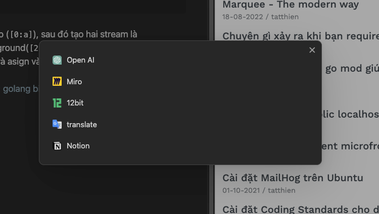

> Join our discord server: [join now](https://discord.gg/wpyAsJMd)

# Obsidian Open Gate

Obsidian Open Gate is a plugin for Obsidian, a popular note-taking app. This plugin allows you to embed any website into Obsidian, providing a seamless browsing and note-taking experience. Whether you're researching, studying, or just browsing the web, Obsidian Open Gate keeps everything you need in one place.

## Installation

Click here to install the plugin: [Direct Install](https://obsidian.md/plugins?id=open-gate)

## Features

-   Embed any website in your Obsidian
-   Auto generate icon
-   Embed any site that can not be embedded by iframe: Google Translate
-   Support for mobile
-   Custom CSS

## Usage

To use Obsidian Open Gate, follow these steps:

1. Open the command palette and type `New gate`.
2. Enter the URL and title of the website you want to embed.
3. Click `Create`.


You will then see the icon of the website in the left sidebar of Obsidian. Clicking on it.

### Simple Options


Add new gate does not require to restart Obsidian. But editing and deleting gate requires to restart Obsidian.

### Use Code block

You can use a code block with the language set to `gate` to embed any website directly within a note, including custom css.

````markdown
```gate
https://12bit.vn
height: 300
css: |
   html { filter: invert(90%) hue-rotate(180deg)!important; }
```
````

### Quick switcher

You can quickly open gates using a single shortcut. The default is `Ctrl+Shift+G` or `Cmd+Shift+G`. You can change it in the Hotkeys section of Obsidian.



## Deployment

This project uses `bun` for building. To build the plugin, follow these steps:

1. Ensure you have `bun` installed.
2. Run `bun install`.
3. Navigate to the project directory and run `bun run build`.

## Contributing

We welcome contributions from everyone. If you're interested in contributing, here's how you can do it:

1. Fork the repository.
2. Create a new branch for your changes.
3. Make your changes in your branch.
4. Submit a pull request.

## Contributors ✨

Thanks goes to these wonderful people.

<!-- ALL-CONTRIBUTORS-LIST:START - Do not remove or modify this section -->
<!-- prettier-ignore-start -->
<!-- markdownlint-disable -->
<table>
  <tbody>
    <tr>
      <td align="center" valign="top" width="14.28%"><a href="https://github.com/andrewmcgivery"><br /><sub><b>andrewmcgivery</b></sub></a><br /><a href="https://github.com/nguyenvanduocit/obsidian-open-gate/commits?author=andrewmcgivery" title="Code">💻</a></td>
      <td align="center" valign="top" width="14.28%"><a href="https://github.com/miztizm"><br /><sub><b>Digital Alchemist</b></sub></a><br /><a href="https://github.com/nguyenvanduocit/obsidian-open-gate/commits?author=miztizm" title="Code">💻</a></td>
      <td align="center" valign="top" width="14.28%"><a href="https://github.com/LiamSwayne"><br /><sub><b>Liam Swayne</b></sub></a><br /><a href="https://github.com/nguyenvanduocit/obsidian-open-gate/commits?author=LiamSwayne" title="Code">💻</a></td>
    </tr>
  </tbody>
</table>

<!-- markdownlint-restore -->
<!-- prettier-ignore-end -->

<!-- ALL-CONTRIBUTORS-LIST:END -->
