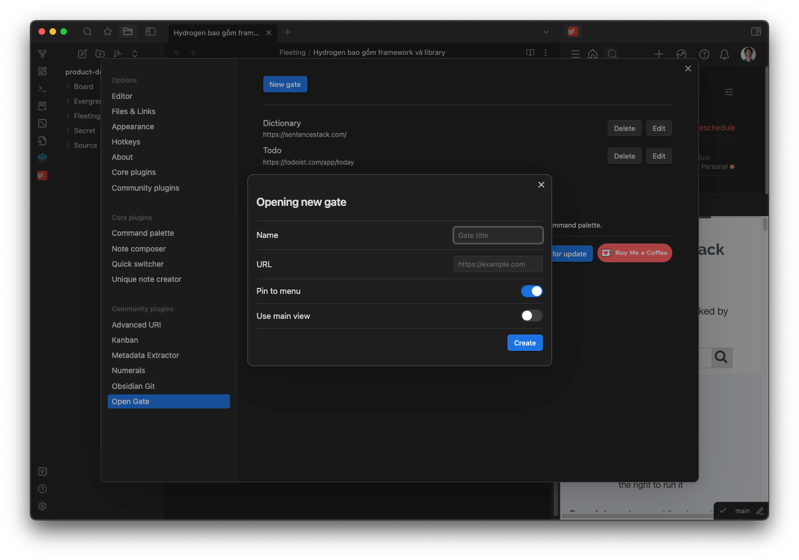

> Join our discord server: [join now](https://discord.gg/wpyAsJMd)

# Obsidian Open Gate

Obsidian Open Gate is a plugin for Obsidian, a popular note-taking app. This plugin allows you to embed any website into Obsidian, providing a seamless browsing and note-taking experience. Whether you're researching, studying, or just browsing the web, Obsidian Open Gate keeps everything you need in one place.

## Table of Contents

-   [Installation](#installation)
-   [Features](#features)
-   [Usage: UI Gate](#usage-ui-gate)
    -   [Simple Options](#simple-options)
    -   [Quick Switcher](#quick-switcher)
    -   [Linking to Gates from Notes](#linking-to-gates-from-notes)
-   [Usage: Code Block](#usage-code-block)
-   [Deployment](#deployment)
-   [Contributing](#contributing)
-   [Contributors](#contributors-✨)

## Installation

Click here to install the plugin: [Direct Install](https://obsidian.md/plugins?id=open-gate)

## Features

-   Embed any website in your Obsidian UI as a "Gate"
-   Open a Gate on the left, center, or right of the Obsidian UI
-   Embed a Gate directly within a note
-   Auto generate icon based on the site's favicon
-   Embed any site that can not be embedded by iframe
-   Support for mobile
-   Inject custom CSS to match the look and feel of Obsidian
-   Link to Gates from within your notes

## Usage: UI Gate

To use Obsidian Open Gate, follow these steps:

1. Open the command palette and type `New gate`.
2. Enter the URL and title of the website you want to embed.
3. Click `Create`.



You will then see the icon of the website in the left sidebar of Obsidian. Clicking on it.

Add new gate does not require to restart Obsidian. But editing and deleting gate requires to restart Obsidian.

### Quick switcher

You can quickly open gates using a single shortcut. The default is `Ctrl+Shift+G` or `Cmd+Shift+G`. You can change it in the Hotkeys section of Obsidian.


### Linking to Gates from Notes

You can also open a new Gate from within a note. By using the `obsidian://opengate` protocol.

#### Open pre-configured Gate

You can use a link in your notes to open a configured UI Gate and optionally open a specific URL in that Gate.

By default, the plugin will find the first Gate that matches the title or URL provided.

```markdown
Example 1: Open the Gate with a title of "googledocs".
Will simply open the gate as configured.

[Open Google Gate](obsidian://opengate?title=googledocs)

```

Sometime, you want to change the url of the configured gate. You can do that by adding `url` parameter to the link.

```markdown
Example 2: Open the Gate with a title of "googledocs" and go to a specific document.
Will navigate to the provided URL in the "googledocs" Gate.
Note: The original URL is: https://docs.google.com/document/d/abc123/edit but has been URL Encoded

[Open Google Gate](obsidian://opengate?title=google&url=https%3A%2F%2Fdocs.google.com%2Fdocument%2Fd%2Fabc123%2Fedit)
```

The gate will have them same configuration as the one you configured in the settings, but the url will be changed to the one you provided.

#### Open a temporary Gate

If no Gate is found, the plugin will open a temporary Gate with the provided URL, this gate will not be saved and will be deleted when you close it. To prevent multiple temporary Gates from being opened, which can lead to performance issues like Chrome tabs, the plugin only allow you to open one temporary Gate at a time.

The usage is exactly the same as the pre-configured Gate, but you no need to match the title or url.

## Usage: Code Block

You can use a code block with the language set to `gate` to embed any website directly within a note, including custom css.

````markdown
```gate
https://12bit.vn
height: 300
css: |
   html { filter: invert(90%) hue-rotate(180deg)!important; }
```
````

## Deployment

This project uses `bun` for building. To build the plugin, follow these steps:

1. Ensure you have `bun` installed.
2. Run `bun install`.
3. Navigate to the project directory and run `bun run build`.

## Contributing

We welcome contributions from everyone. If you're interested in contributing, here's how you can do it:

1. Fork the repository.
2. Create a new branch for your changes.
3. Make your changes in your branch.
4. Submit a pull request.

## Contributors ✨

Thanks goes to these wonderful people.

<!-- ALL-CONTRIBUTORS-LIST:START - Do not remove or modify this section -->
<!-- prettier-ignore-start -->
<!-- markdownlint-disable -->
<table>
  <tbody>
    <tr>
      <td align="center" valign="top" width="14.28%"><a href="https://github.com/andrewmcgivery"><br /><sub><b>andrewmcgivery</b></sub></a><br /><a href="https://github.com/nguyenvanduocit/obsidian-open-gate/commits?author=andrewmcgivery" title="Code">💻</a></td>
      <td align="center" valign="top" width="14.28%"><a href="https://github.com/miztizm"><br /><sub><b>Digital Alchemist</b></sub></a><br /><a href="https://github.com/nguyenvanduocit/obsidian-open-gate/commits?author=miztizm" title="Code">💻</a></td>
      <td align="center" valign="top" width="14.28%"><a href="https://github.com/LiamSwayne"><br /><sub><b>Liam Swayne</b></sub></a><br /><a href="https://github.com/nguyenvanduocit/obsidian-open-gate/commits?author=LiamSwayne" title="Code">💻</a></td>
    </tr>
  </tbody>
</table>

<!-- markdownlint-restore -->
<!-- prettier-ignore-end -->

<!-- ALL-CONTRIBUTORS-LIST:END -->
